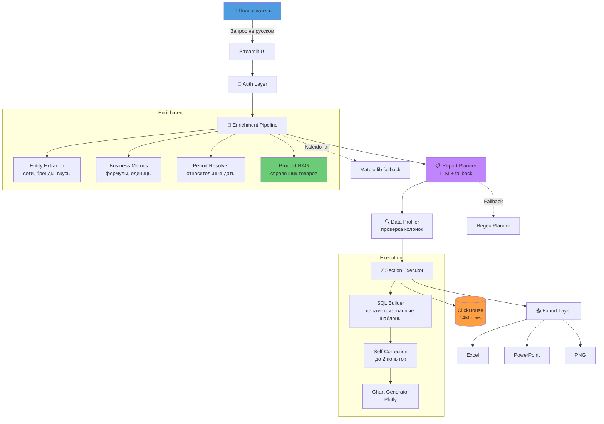
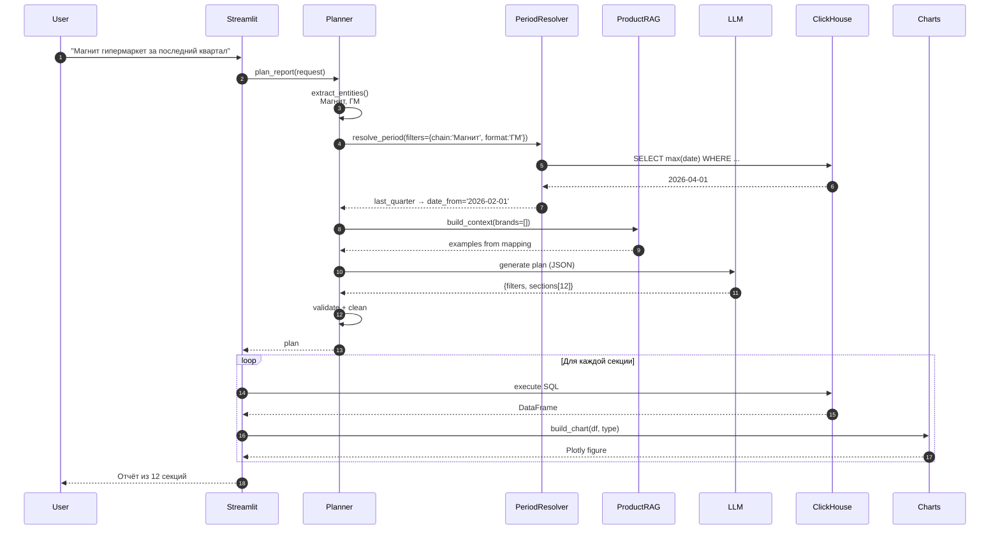
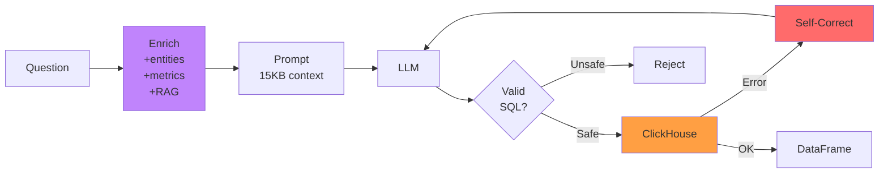

<div align="center">

# 📊 Sales Analytics AI Agent

### Conversational BI-платформа для генерации аналитических отчётов на естественном языке

Спроси "Магнит ГМ 120г за последний квартал по вкусам" — получи **12 секций графиков**, **Excel-выгрузку** и **PowerPoint-презентацию**. За 40 секунд.

[](https://python.org)
[](https://streamlit.io)
[](https://clickhouse.com)
[](https://docker.com)
[](https://openrouter.ai)

[🎥 Демо-видео](#-демо) · [🚀 Быстрый старт](#-запуск-за-5-минут) · [🏗 Архитектура](#-архитектура) · [🧠 Как работает AI](#-как-работает-ai)

</div>

---

## 🎯 Что это

**Sales Analytics AI Agent** — production-ready платформа для автоматической генерации BI-отчётов. Пользователь описывает задачу на русском языке, система:

1. 🧠 **Понимает контекст** — извлекает сущности (сети, бренды, вкусы, форматы), метрики, временные периоды
2. 📋 **Строит план отчёта** — генерирует структуру из 10-15 секций через LLM
3. 🔍 **Проверяет данные** — профилирует что заполнено, убирает пустые секции
4. 📊 **Выполняет SQL** — параметризованные шаблоны + генерация через LLM с self-correction
5. 🎨 **Визуализирует** — 7 типов графиков, оформленных в единой dark-теме
6. 📥 **Экспортирует** — Excel с настраиваемой структурой + автогенерируемая PPTX-презентация

Работает на реальных данных: **14 миллионов записей** о продажах чипсов в **19 розничных сетях России** (Магнит, Пятерочка, Дикси, Ашан, Лента, Перекресток и др.), **~30 тысяч магазинов**, **~3.5 тысячи SKU** за период 2023-2026.

---

## ✨ Ключевые фичи

### 🎨 UI/UX
- 🎯 **Один запрос → полный отчёт**: 10-15 секций графиков + KPI + таблицы
- 📅 **Понимание относительных периодов**: "последний период", "прошлый квартал", "год к году" — с учётом контекста фильтров
- ✍️ **Пожелания к структуре Excel**: "excel-отчёт по: сеть, регион, бренд, вкус"
- 🎨 **Единая dark-тема** для UI, графиков, Excel и PPTX
- 🔐 **Авторизация** через логин/пароль (расширяется до ролей)

### 🧠 AI/ML
- 🤖 **Fallback между 12 LLM моделями** (GPT-OSS 120B, Llama 3.3, Qwen 3, Gemma 4 и др.)
- 📚 **RAG над справочником товаров** (3800 SKU) — точное распознавание вкусов и брендов
- 🎯 **Context-aware period resolver** — для Ашана "последний месяц" может быть Апрель 2026, для Магнита — Май 2026
- 🔧 **Self-correction** — если SQL упал, LLM видит ошибку и переписывает (до 2 попыток)
- 💾 **Кэш планов** — одинаковые запросы обрабатываются мгновенно
- 🛡 **Regex-fallback планировщик** — работает даже если все LLM недоступны

### 📊 Аналитика
- 📈 **7 типов графиков**: bar, line, pie (donut), lollipop, grouped bar, small multiples, heatmap
- 📉 **Динамика** автоматически разделяется на 3 линии: выручка / количество / средняя цена
- 🧮 **Библиотека бизнес-метрик**: маржа, цена за грамм, нормализация к целевой граммовке
- 🔍 **Data profiling** — секции с пустыми колонками автоматически удаляются

### 💾 Экспорт
- 📥 **Excel** — иерархическая структура с автофильтром, формулами, форматированием
- 🎨 **PowerPoint** — многослайдовая презентация со всеми графиками
- 🖼 **PNG** — скачивание каждого графика отдельно

### 🛡 Безопасность
- ✅ Только `SELECT` и `WITH` — блокировка `DROP`, `DELETE`, `INSERT`, `ALTER`
- ✅ Whitelist chart types и колонок group_by
- ✅ Экранирование строковых значений
- ✅ `LIMIT 1000` по умолчанию
- ✅ Хранение секретов через `.env`

---

## 🎥 Демо

<div align="center">

**[▶️ Смотреть демо-видео](https://youtu.be/YOUR_LINK)** _(2 минуты)_

</div>

### Скриншоты

<details>
<summary><b>🚀 Форма запроса</b></summary>

</details>

<details>
<summary><b>📊 KPI-карточки</b></summary>

</details>

<details>
<summary><b>📈 Динамика по месяцам</b></summary>

</details>

<details>
<summary><b>🎯 Топ регионов + Small multiples</b></summary>

</details>

<details>
<summary><b>💰 Цена vs Себестоимость с маржой</b></summary>

</details>

<details>
<summary><b>📥 Excel-выгрузка</b></summary>

</details>

<details>
<summary><b>🎨 PPTX-презентация</b></summary>

</details>

---

## 🏗 Архитектура

### Общая схема



### Поток данных для одного запроса



### Технологический стек

| Слой | Технологии |
|------|-----------|
| **Frontend** | Streamlit, Plotly (интерактивные графики), кастомные HTML KPI-карточки |
| **Backend** | Python 3.12, httpx (async HTTP) |
| **LLM Layer** | OpenRouter API (12 моделей), fallback ротация, кэш планов |
| **Data Layer** | ClickHouse (14M rows), pandas, clickhouse-connect |
| **RAG** | In-memory справочник товаров (3800 SKU), fuzzy matching (rapidfuzz) |
| **Экспорт** | openpyxl (Excel), python-pptx (PowerPoint), kaleido + matplotlib fallback (PNG) |
| **Auth** | Streamlit forms + session state, .env credentials |
| **Deploy** | Docker Compose, Yandex Cloud VM (Ubuntu 24.04) |
| **DevOps** | Grafana, Prometheus, cAdvisor (мониторинг) |

---

## 🧠 Как работает AI

### Проблема
Простой text-to-SQL агент делает 3 фатальные ошибки:
1. **Галлюцинирует значения** — пишет `store_format='Гипермаркет'` вместо `'ГМ'`
2. **Плохо понимает контекст** — "последний месяц" для Ашана и Магнита могут быть разными
3. **Ошибается в бизнес-формулах** — нормализация к 120г, цена за грамм, взвешенная средняя

### Решение — 6 уровней защиты от галлюцинаций

#### 1️⃣ Entity Extractor с контекстными маркерами
```python
# "по сети Глобус" → chains=['Глобус'], НЕ brands=['Глобус']
# "бренд Глобус" → brands=['Глобус']
CHAIN_MARKERS = [r"\bсет[иьяе]", r"\bритейлер"]
BRAND_MARKERS = [r"\bбренд", r"\bмарка", r"\bтм\b"]
```

Плюс защита от ложных матчей: "гипермаркет" → **не должен** извлечь бренд "Маркет".

#### 2️⃣ Product RAG над справочником
При запросе "вкус краба" — не даём LLM гадать, а подсовываем **реальные значения**:
```
=== РЕАЛЬНЫЕ ВКУСЫ В СПРАВОЧНИКЕ ===
flavor IN ('Краб', 'Камчатский краб', 'Крабовый')
```

Плюс контекст со всеми комбинациями (бренд + вкус + грамм) для распознанных брендов.

#### 3️⃣ Column Values Hints
На старте загружаем **топ-N уникальных значений** для категориальных колонок:
```
retail_chain: 'Магнит', 'Пятерочка', 'Дикси', 'Ашан', ...
store_format: 'ГМ', 'СМ', 'У', 'Дискаунтер'
chip_type: 'Картофельные чипсы', 'Кукурузные чипсы', ...
```

Плюс маппинг разговорных слов: `гипермаркет → ГМ`, `супермаркет → СМ`.

#### 4️⃣ Context-aware Period Resolver
Для фразы "последний период" смотрим **реальный max(date) с учётом фильтров**:

```python
# Для Ашана
SELECT max(date) FROM sales_mart WHERE retail_chain='Ашан'
→ '2026-04-01' → Апрель 2026

# Для Магнита
SELECT max(date) FROM sales_mart WHERE retail_chain='Магнит'  
→ '2026-05-01' → Май 2026
```

Иерархический fallback: если по полным фильтрам данных нет, ослабляем до `retail_chain + chip_type`, потом только `retail_chain`.

#### 5️⃣ Business Metrics Library
Готовые формулы для сложных вычислений:

```python
"price_per_gram": {
    "formula": """SUM(sales_amount_rub) 
                  / NULLIF(SUM(sales_quantity), 0) 
                  / NULLIF(toFloat64OrZero(toString(weight_grams)), 0)"""
},
"price_normalized": {
    "formula_template": """цена_за_упаковку 
                          / вес * {target_grams}"""
}
```

LLM видит готовую формулу — не изобретает свою.

#### 6️⃣ Self-correction Loop
Если SQL упал в ClickHouse:
```
LLM генерирует SQL → ClickHouse: "Illegal type of argument"
    ↓
LLM видит ошибку → генерирует исправленный SQL
    ↓
До 2 попыток исправления
```

### Двухуровневая архитектура для сложных отчётов

Вместо одного огромного SQL — **planner + executor**:

**Планировщик** (LLM): возвращает **JSON-план** из 10-15 секций
```json
{
  "filters": {"retail_chain": "Магнит", "year": 2026, "month": "Апрель"},
  "sections": [
    {"title": "KPI", "chart_type": "kpi", "group_by": []},
    {"title": "Топ регионов", "chart_type": "bar", "group_by": ["region_name"]},
    {"title": "Топ SKU", "chart_type": "lollipop", "group_by": ["brand", "product_name"]},
    ...
  ]
}
```

**Executor** (код): для каждой секции строит SQL **из параметризованного шаблона** — LLM НЕ пишет фильтры руками. Это резко снижает галлюцинации.

---

## 🚀 Запуск за 5 минут

### Требования
- Docker + Docker Compose
- ClickHouse с данными о продажах (или свои данные — код легко адаптируется)
- API-ключ [OpenRouter](https://openrouter.ai) (бесплатный tier)

### Установка

```bash
# 1. Клонируй репозиторий
git clone https://github.com/YOUR_USERNAME/sales-analytics-ai-agent.git
cd sales-analytics-ai-agent/ai-agent

# 2. Скопируй .env шаблон
cp .env.example .env

# 3. Отредактируй .env — вставь ключ OpenRouter и данные ClickHouse
nano .env
```

Пример `.env`:
```env
OPENROUTER_API_KEY=sk-or-v1-...
CLICKHOUSE_HOST=clickhouse
CLICKHOUSE_PORT=8123
CLICKHOUSE_USER=admin
CLICKHOUSE_PASSWORD=secret
CLICKHOUSE_DATABASE=default
CLICKHOUSE_TABLE=sales_mart

AUTH_ENABLED=true
AUTH_USERS=admin:admin123,manager:manager2026

LLM_MODELS=openai/gpt-oss-120b:free,google/gemma-4-31b-it:free,meta-llama/llama-3.3-70b-instruct:free
```

```bash
# 4. Запусти
docker-compose up -d --build ai-agent

# 5. Открой в браузере
http://localhost:8501
```

По умолчанию: логин `admin`, пароль `admin123`.

---

## 📚 Примеры использования

### Простой отчёт
```
Отчёт по Магниту за 2026 год
```

### С относительным периодом
```
Ашан за последний квартал
```

### С приоритетными вкусами
```
Магнит ГМ 120г картофельные чипсы 2026, полный анализ по территориям 
с приоритетными вкусами (Сметана и лук, Морепродукты, Томат)
```

### С кастомной структурой Excel
```
Анализ Глобуса за май 2026. Excel-отчёт по: сеть, регион, город, 
бренд, вкус, граммовка, средняя цена продажи, товарооборот
```

### Сложная бизнес-задача
```
Картофельные чипсы 70 120 140 180 220 225 250 грамм: 
цена, себестоимость, цена за грамм, нормализация к 120г
```

---

## 📁 Структура проекта

```
ai-agent/
├── Dockerfile                    # Python 3.12 + Streamlit
├── requirements.txt              # Зависимости
├── .env.example                  # Шаблон конфигурации
└── app/
    ├── app.py                    # 🎨 Streamlit UI (главный файл)
    │
    ├── auth.py                   # 🔐 Авторизация
    │
    ├── report.py                 # 🎯 Оркестратор построения отчёта
    ├── report_planner.py         # 📋 LLM-планировщик + regex fallback
    ├── sql_builder.py            # 🔧 Параметризованные SQL-шаблоны
    ├── data_profile.py           # 🔍 Анализ заполненности колонок
    │
    ├── entities.py               # 🎯 Extraction: бренды, сети, вкусы
    ├── metadata.py               # 📚 Схема таблицы + бизнес-правила
    ├── examples.py               # 💡 Few-shot примеры SQL
    ├── metrics.py                # 🧮 Библиотека бизнес-метрик
    ├── product_rag.py            # 🔍 RAG над справочником товаров
    ├── period_resolver.py        # 📅 Разрешение относительных дат
    ├── column_values.py          # 📊 Кэш уникальных значений колонок
    │
    ├── llm.py                    # 🤖 OpenRouter клиент + fallback
    ├── prompts.py                # 📝 Системные промпты
    │
    ├── database.py               # 💾 ClickHouse клиент
    ├── config.py                 # ⚙️ Конфигурация из .env
    │
    ├── charts.py                 # 📊 7 типов графиков (Plotly)
    ├── kpi_cards.py              # 🎴 HTML KPI-карточки
    │
    ├── excel_report.py           # 📥 Excel-экспорт
    ├── pptx_report.py            # 🎨 PowerPoint-экспорт
    └── utils.py                  # 🛠 Утилиты
```

---

## 🎨 Типы визуализаций

| Тип | Использование | Стиль |
|-----|---------------|-------|
| 🎴 **KPI Cards** | Обзор ключевых показателей | Цветные карточки со скруглёнными углами |
| 📊 **Horizontal Bar** | Топ регионов, брендов, вкусов | Градиентная палитра + подписи с % |
| 📈 **Line** | Динамика по времени | Заливка под линией, метки на точках |
| 🥧 **Donut Pie** | Доли брендов, вкусов | Легенда с суммами и штуками |
| 🍭 **Lollipop** | Топ-20 SKU | Точки на линиях, подписи справа |
| 📊 **Grouped Bar** | Цена vs себестоимость | Красный/бирюзовый + подпись маржи 💚 |
| 🎯 **Small Multiples** | Топ вкусов внутри каждого бренда | Сетка 3x3 мини-графиков |

Все графики в единой dark-теме `#0d1117` с акцентными цветами.

---

## ⚙️ Технические детали

### LLM Fallback Strategy
```python
LLM_MODELS = [
    "openai/gpt-oss-120b:free",           # ★ основная
    "google/gemma-4-31b-it:free",         # быстрая
    "meta-llama/llama-3.3-70b-instruct:free",
    "qwen/qwen3-coder:free",              # специализирована на коде
    "nvidia/nemotron-3-super-120b-a12b:free",
    # ... 12 моделей всего
]
```

При запросе:
1. Случайная перемешка (чтобы не долбить одну)
2. Retry при 429 (rate limit) с ожиданием
3. Fallback на следующую модель
4. Если все упали → **regex-based fallback планировщик**

### SQL Generation Pipeline



### Кэширование

| Уровень | Что кэшируем | TTL |
|---------|--------------|-----|
| `@lru_cache` | Product mapping (3800 SKU) | Пожизненно |
| `@lru_cache` | Column values | Пожизненно |
| `@lru_cache` | Global data range | Пожизненно |
| In-memory dict | LLM планы отчётов | До перезапуска |

### Метрики производительности

Для запроса **"Магнит ГМ 120г полный отчёт"** на 14M строк ClickHouse:

| Этап | Время |
|------|-------|
| Планирование (LLM) | 15-40s (зависит от модели) |
| Профилирование | 0.1s |
| 12 SQL секций | 10-15s |
| Генерация графиков | 2s |
| **Итого** | **30-60s** |

При кэше плана: **10-15s** (только SQL + графики).

---

## 🔐 Безопасность

### SQL Injection защита
```python
DANGEROUS_KEYWORDS = ["INSERT", "UPDATE", "DELETE", "DROP", "ALTER", 
                     "TRUNCATE", "CREATE", "GRANT", "REVOKE"]

# 1. Whitelist: только SELECT / WITH
# 2. Regex-проверка на dangerous keywords
# 3. Экранирование строк
# 4. LIMIT 1000 по умолчанию
# 5. Запрет ; (multiple statements)
```

### Аутентификация
- Логин/пароль хранятся в `.env` (в проде — hash + salt)
- Session state Streamlit
- Кнопка logout

### Секреты
- `.env` в `.gitignore`
- API-ключи никогда не логируются

---

## 🗺 Roadmap

### v1.0 (текущий релиз) ✅
- [x] Text-to-SQL с self-correction
- [x] LLM fallback (12 моделей)
- [x] Product RAG
- [x] Period resolver
- [x] Excel + PPTX экспорт
- [x] Авторизация

### v1.1 (в работе)
- [ ] 🔮 AI Insights — LLM пишет выводы под отчётом
- [ ] 💡 Follow-up questions — кнопки продолжения диалога
- [ ] ❓ Clarification — уточняющие вопросы при неоднозначности

### v2.0 (планируется)
- [ ] 🧠 Tool-use агент (ReAct pattern)
- [ ] 📚 История в SQLite + повторное использование
- [ ] 📧 Email рассылка отчётов
- [ ] 🌐 Multi-tenant (изолированные workspace'ы)
- [ ] 🔄 Semantic cache через векторную БД

---